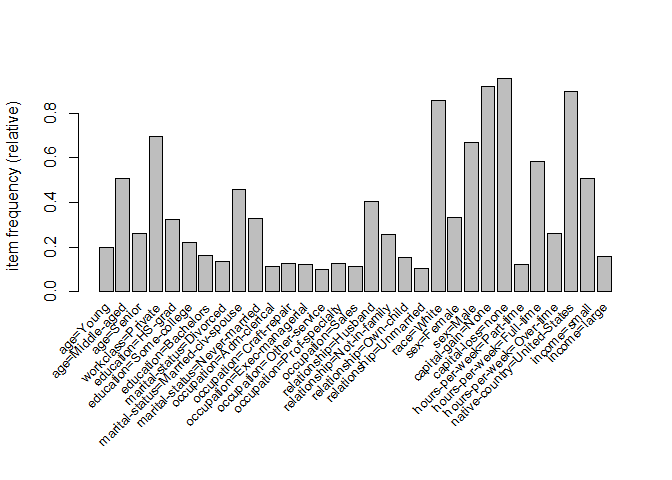

# AdultUCI Dataset Analysis
renlanchuke  
2016年3月30日  
来源:[Introduction to arules – A computational environment for mining
association rules and frequent item sets][1]

数据集来源加州大学欧文分校机器学习数据库http://archive.ics.uci.edu/ml/

Adult数据集：美国人口统计局关于影响收入因素（如年龄，工作类别，教育等）调查问卷数据，有4.8万个记录。

```r
#加载arules包
library(arules)
```

```
## Loading required package: Matrix
## 
## Attaching package: 'arules'
## 
## The following objects are masked from 'package:base':
## 
##     abbreviate, write
```

```r
data("AdultUCI")
dim(AdultUCI)
```

```
## [1] 48842    15
```


```r
AdultUCI[1:2,]
```

```
##   age        workclass fnlwgt education education-num     marital-status
## 1  39        State-gov  77516 Bachelors            13      Never-married
## 2  50 Self-emp-not-inc  83311 Bachelors            13 Married-civ-spouse
##        occupation  relationship  race  sex capital-gain capital-loss
## 1    Adm-clerical Not-in-family White Male         2174            0
## 2 Exec-managerial       Husband White Male            0            0
##   hours-per-week native-country income
## 1             40  United-States  small
## 2             13  United-States  small
```

fnlwgt是数据收集者创造的一个权重，education-num就是教育水平的编号

去除这两个属性

```r
AdultUCI[["fnlwgt"]] <- NULL
AdultUCI[["education-num"]] <- NULL
```
根据一般的经验知识将度量数据映射到顺序属性中


```r
#将度量属性age转换为类别，分别标记为Young,Middle-aged,Senior,Old
AdultUCI[["age"]] <- ordered(cut(AdultUCI[["age"]], c(15,25,45,65,100)),
        labels = c("Young", "Middle-aged", "Senior", "Old"))

#将度量属性hours-per-week转化为类别，分别标记为Young，Middle-aged，Senior，Old
AdultUCI[["hours-per-week"]] <- ordered(cut(AdultUCI[["hours-per-week"]], c(0,25,40,60,168)),labels = c("Part-time", "Full-time", "Over-time", "Workaholic"))

#将度量属性capital-gain转化为类别，分别标记为none，low，high
AdultUCI[["capital-gain"]] <- ordered(cut(AdultUCI[[ "capital-gain"]],      c(-Inf,0,median(AdultUCI[["capital-gain"]][AdultUCI[[ "capital-gain"]]>0]),Inf)),labels = c("None", "Low", "High"))

#将度量属性capital-loss转化为类别，分别标记为none，low，high
AdultUCI[["capital-loss"]] <- ordered(cut(AdultUCI[["capital-loss"]],          c(-Inf,0,median(AdultUCI[["capital-loss"]][AdultUCI[[ "capital-loss"]]>0]),Inf)),labels = c("none", "low", "high"))
```


```r
Adult <- as(AdultUCI, "transactions")
Adult
```

```
## transactions in sparse format with
##  48842 transactions (rows) and
##  115 items (columns)
```


```r
 summary(Adult)
```

```
## transactions as itemMatrix in sparse format with
##  48842 rows (elements/itemsets/transactions) and
##  115 columns (items) and a density of 0.1089939 
## 
## most frequent items:
##            capital-loss=none            capital-gain=None 
##                        46560                        44807 
## native-country=United-States                   race=White 
##                        43832                        41762 
##            workclass=Private                      (Other) 
##                        33906                       401333 
## 
## element (itemset/transaction) length distribution:
## sizes
##     9    10    11    12    13 
##    19   971  2067 15623 30162 
## 
##    Min. 1st Qu.  Median    Mean 3rd Qu.    Max. 
##    9.00   12.00   13.00   12.53   13.00   13.00 
## 
## includes extended item information - examples:
##            labels variables      levels
## 1       age=Young       age       Young
## 2 age=Middle-aged       age Middle-aged
## 3      age=Senior       age      Senior
## 
## includes extended transaction information - examples:
##   transactionID
## 1             1
## 2             2
## 3             3
```
画出支持度大于10%的频集

```r
#support 支持度 cex.names=变量标签大小
itemFrequencyPlot(Adult, support = 0.1, cex.names=0.8)
```

 

用aprori算法找到所有支持度大于0.01，置信度大于0.6的规则

```r
rules <- apriori(Adult,parameter = list(support = 0.01, confidence = 0.6))
```

```
## Apriori
## 
## Parameter specification:
##  confidence minval smax arem  aval originalSupport support minlen maxlen
##         0.6    0.1    1 none FALSE            TRUE    0.01      1     10
##  target   ext
##   rules FALSE
## 
## Algorithmic control:
##  filter tree heap memopt load sort verbose
##     0.1 TRUE TRUE  FALSE TRUE    2    TRUE
## 
## Absolute minimum support count: 488 
## 
## set item appearances ...[0 item(s)] done [0.00s].
## set transactions ...[115 item(s), 48842 transaction(s)] done [0.05s].
## sorting and recoding items ... [67 item(s)] done [0.01s].
## creating transaction tree ... done [0.04s].
## checking subsets of size 1 2 3 4 5 6 7 8 9 10 done [1.01s].
## writing ... [276443 rule(s)] done [0.08s].
## creating S4 object  ... done [0.28s].
```


```r
rules
```

```
## set of 276443 rules
```


```r
summary(rules)
```

```
## set of 276443 rules
## 
## rule length distribution (lhs + rhs):sizes
##     1     2     3     4     5     6     7     8     9    10 
##     6   432  4981 22127 52669 75104 67198 38094 13244  2588 
## 
##    Min. 1st Qu.  Median    Mean 3rd Qu.    Max. 
##   1.000   5.000   6.000   6.289   7.000  10.000 
## 
## summary of quality measures:
##     support          confidence          lift        
##  Min.   :0.01001   Min.   :0.6000   Min.   : 0.7171  
##  1st Qu.:0.01253   1st Qu.:0.7691   1st Qu.: 1.0100  
##  Median :0.01701   Median :0.9051   Median : 1.0554  
##  Mean   :0.02679   Mean   :0.8600   Mean   : 1.3109  
##  3rd Qu.:0.02741   3rd Qu.:0.9542   3rd Qu.: 1.2980  
##  Max.   :0.95328   Max.   :1.0000   Max.   :20.6826  
## 
## mining info:
##   data ntransactions support confidence
##  Adult         48842    0.01        0.6
```

选取提升度大于1.2的规则

```r
rulesIncomeSmall <- subset(rules, subset = rhs %in% "income=small" & lift > 1.2)
rulesIncomeLarge <- subset(rules, subset = rhs %in% "income=large" & lift > 1.2)
```
查看收入低规则中，置信度最高的3个规则

```r
inspect(head(rulesIncomeSmall, n = 3, by = "confidence"))
```

```
##   lhs                               rhs               support confidence     lift
## 1 {workclass=Private,                                                            
##    marital-status=Never-married,                                                 
##    relationship=Own-child,                                                       
##    sex=Male,                                                                     
##    hours-per-week=Part-time,                                                     
##    native-country=United-States} => {income=small} 0.01074895  0.7104195 1.403653
## 2 {workclass=Private,                                                            
##    marital-status=Never-married,                                                 
##    relationship=Own-child,                                                       
##    sex=Male,                                                                     
##    hours-per-week=Part-time}     => {income=small} 0.01144507  0.7102922 1.403402
## 3 {workclass=Private,                                                            
##    marital-status=Never-married,                                                 
##    relationship=Own-child,                                                       
##    sex=Male,                                                                     
##    capital-gain=None,                                                            
##    hours-per-week=Part-time,                                                     
##    native-country=United-States} => {income=small} 0.01046231  0.7097222 1.402276
```

查看收入高规则中，置信度最高的3个规则

```r
inspect(head(rulesIncomeLarge, n = 3, by = "confidence"))
```

```
##   lhs                                    rhs               support confidence     lift
## 1 {marital-status=Married-civ-spouse,                                                 
##    capital-gain=High,                                                                 
##    native-country=United-States}      => {income=large} 0.01562180  0.6849192 4.266398
## 2 {marital-status=Married-civ-spouse,                                                 
##    capital-gain=High,                                                                 
##    capital-loss=none,                                                                 
##    native-country=United-States}      => {income=large} 0.01562180  0.6849192 4.266398
## 3 {relationship=Husband,                                                              
##    race=White,                                                                        
##    capital-gain=High,                                                                 
##    native-country=United-States}      => {income=large} 0.01302158  0.6846071 4.264454
```

将规则写入磁盘

```r
write(rulesIncomeSmall, file = "data.csv", sep = ",", col.names = NA)
```

[1]:https://cran.r-project.org/web/packages/arules/vignettes/arules.pdf
