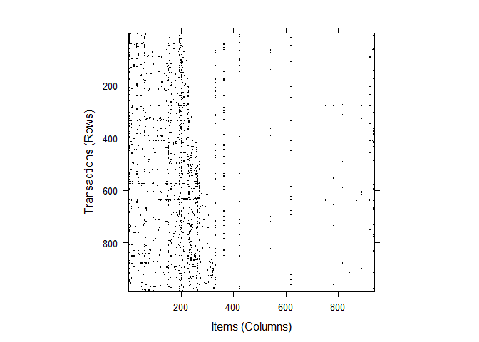

# Arules Package Exploring
renlanchuke  
2016年3月30日  
来源:[Introduction to arules – A computational environment for mining
association rules and frequent item sets][1]

###1 分析处理交易数据集
Epub是一个电子出版平台下载文件的数据集 http://epub.wu-wien.ac.at


```r
#加载arules包
library(arules)
```

```
## Loading required package: Matrix
## 
## Attaching package: 'arules'
## 
## The following objects are masked from 'package:base':
## 
##     abbreviate, write
```

```r
data("Epub")
Epub
```

```
## transactions in sparse format with
##  15729 transactions (rows) and
##  936 items (columns)
```


```r
summary(Epub)
```

```
## transactions as itemMatrix in sparse format with
##  15729 rows (elements/itemsets/transactions) and
##  936 columns (items) and a density of 0.001758755 
## 
## most frequent items:
## doc_11d doc_813 doc_4c6 doc_955 doc_698 (Other) 
##     356     329     288     282     245   24393 
## 
## element (itemset/transaction) length distribution:
## sizes
##     1     2     3     4     5     6     7     8     9    10    11    12 
## 11615  2189   854   409   198   121    93    50    42    34    26    12 
##    13    14    15    16    17    18    19    20    21    22    23    24 
##    10    10     6     8     6     5     8     2     2     3     2     3 
##    25    26    27    28    30    34    36    38    41    43    52    58 
##     4     5     1     1     1     2     1     2     1     1     1     1 
## 
##    Min. 1st Qu.  Median    Mean 3rd Qu.    Max. 
##   1.000   1.000   1.000   1.646   2.000  58.000 
## 
## includes extended item information - examples:
##    labels
## 1 doc_11d
## 2 doc_13d
## 3 doc_14c
## 
## includes extended transaction information - examples:
##       transactionID           TimeStamp
## 10792  session_4795 2003-01-02 09:59:00
## 10793  session_4797 2003-01-02 20:46:01
## 10794  session_479a 2003-01-02 23:50:38
```


```r
year <- strftime(as.POSIXlt(transactionInfo(Epub)[["TimeStamp"]]), "%Y")
table(year)
```

```
## year
## 2003 2004 2005 2006 2007 2008 2009 
##  986 1376 1610 3010 4052 4692    3
```


```r
Epub2003 <- Epub[year == "2003"]
length(Epub2003)
```

```
## [1] 986
```

交易数据是一个二进制关联矩阵

```r
image(Epub2003)
```

 


```r
transactionInfo(Epub2003[size(Epub2003) > 20])
```

```
##       transactionID           TimeStamp
## 11092  session_56e2 2003-04-30 01:30:38
## 11371  session_6308 2003-08-18 06:16:12
```


```r
inspect(Epub2003[1:5])
```

```
##       items                    transactionID TimeStamp          
## 10792 {doc_154}                session_4795  2003-01-02 09:59:00
## 10793 {doc_3d6}                session_4797  2003-01-02 20:46:01
## 10794 {doc_16f}                session_479a  2003-01-02 23:50:38
## 10795 {doc_11d,doc_1a7,doc_f4} session_47b7  2003-01-03 07:55:50
## 10796 {doc_83}                 session_47bb  2003-01-03 10:27:44
```


```r
as(Epub2003[1:5], "list")
```

```
## $session_4795
## [1] "doc_154"
## 
## $session_4797
## [1] "doc_3d6"
## 
## $session_479a
## [1] "doc_16f"
## 
## $session_47b7
## [1] "doc_11d" "doc_1a7" "doc_f4" 
## 
## $session_47bb
## [1] "doc_83"
```


```r
EpubTidLists <- as(Epub, "tidLists")
EpubTidLists
```

```
## tidLists in sparse format with
##  936 items/itemsets (rows) and
##  15729 transactions (columns)
```

```r
as(EpubTidLists[1:3], "list")
```

```
## $doc_11d
##   [1] "session_47b7"    "session_47c2"    "session_47d8"   
##   [4] "session_4855"    "session_488d"    "session_4898"   
##   [7] "session_489b"    "session_489c"    "session_48a1"   
##  [10] "session_4897"    "session_48a0"    "session_489d"   
##  [13] "session_48a5"    "session_489a"    "session_4896"   
##  [16] "session_48aa"    "session_48d0"    "session_49de"   
##  [19] "session_4b35"    "session_4bac"    "session_4c54"   
##  [22] "session_4c9a"    "session_4d8c"    "session_4de5"   
##  [25] "session_4e89"    "session_5071"    "session_5134"   
##  [28] "session_51e6"    "session_5227"    "session_522a"   
##  [31] "session_5265"    "session_52e0"    "session_52ea"   
##  [34] "session_53e1"    "session_5522"    "session_558a"   
##  [37] "session_558b"    "session_5714"    "session_5739"   
##  [40] "session_57c5"    "session_5813"    "session_5861"   
##  [43] "session_wu48452" "session_5955"    "session_595a"   
##  [46] "session_5aaa"    "session_5acd"    "session_5b5f"   
##  [49] "session_5bfc"    "session_5f3d"    "session_5f42"   
##  [52] "session_5f69"    "session_5fcf"    "session_6044"   
##  [55] "session_6053"    "session_6081"    "session_61b5"   
##  [58] "session_635b"    "session_64b4"    "session_64e4"   
##  [61] "session_65d2"    "session_67d1"    "session_6824"   
##  [64] "session_68c4"    "session_68f8"    "session_6b2c"   
##  [67] "session_6c95"    "session_6e19"    "session_6eab"   
##  [70] "session_6ff8"    "session_718e"    "session_71c1"   
##  [73] "session_72d6"    "session_7303"    "session_73d0"   
##  [76] "session_782d"    "session_7856"    "session_7864"   
##  [79] "session_7a9b"    "session_7b24"    "session_7bf9"   
##  [82] "session_7cf2"    "session_7d5d"    "session_7dae"   
##  [85] "session_819b"    "session_8329"    "session_834d"   
##  [88] "session_84d7"    "session_85b0"    "session_861b"   
##  [91] "session_867f"    "session_8688"    "session_86bb"   
##  [94] "session_86ee"    "session_8730"    "session_8764"   
##  [97] "session_87a9"    "session_880a"    "session_8853"   
## [100] "session_88b0"    "session_8986"    "session_8a08"   
## [103] "session_8a73"    "session_8a87"    "session_8aad"   
## [106] "session_8ae2"    "session_8db4"    "session_8e1f"   
## [109] "session_wu53a42" "session_8fad"    "session_8fd3"   
## [112] "session_9083"    "session_90d8"    "session_9128"   
## [115] "session_9145"    "session_916e"    "session_9170"   
## [118] "session_919e"    "session_91df"    "session_9226"   
## [121] "session_9333"    "session_9376"    "session_937e"   
## [124] "session_94d5"    "session_9539"    "session_9678"   
## [127] "session_96a0"    "session_9745"    "session_97b3"   
## [130] "session_985b"    "session_9873"    "session_9881"   
## [133] "session_9994"    "session_9a20"    "session_9a2f"   
## [136] "session_wu54edf" "session_9af9"    "session_9b69"   
## [139] "session_9ba4"    "session_9c27"    "session_9c99"   
## [142] "session_9ce8"    "session_9de3"    "session_9e8a"   
## [145] "session_9ebc"    "session_a051"    "session_a16e"   
## [148] "session_a19f"    "session_a229"    "session_a24a"   
## [151] "session_a328"    "session_a340"    "session_a3ab"   
## [154] "session_a3ee"    "session_a43a"    "session_a4b2"   
## [157] "session_a515"    "session_a528"    "session_a555"   
## [160] "session_a5bb"    "session_a62d"    "session_a77a"   
## [163] "session_ab9c"    "session_abe9"    "session_ac0e"   
## [166] "session_ad30"    "session_adc9"    "session_af06"   
## [169] "session_af4a"    "session_af8d"    "session_b0b7"   
## [172] "session_b391"    "session_b6d3"    "session_b807"   
## [175] "session_b8c7"    "session_b91f"    "session_bb0b"   
## [178] "session_bb8a"    "session_bc3d"    "session_bc40"   
## [181] "session_bceb"    "session_bea7"    "session_bf9f"   
## [184] "session_c359"    "session_c3c2"    "session_c442"   
## [187] "session_c62d"    "session_c6ba"    "session_c936"   
## [190] "session_ca81"    "session_cad3"    "session_cbd4"   
## [193] "session_cbe1"    "session_cd63"    "session_d14f"   
## [196] "session_d370"    "session_d69f"    "session_d815"   
## [199] "session_d82e"    "session_d849"    "session_d8b5"   
## [202] "session_da68"    "session_db51"    "session_db75"   
## [205] "session_dbcd"    "session_dde2"    "session_deac"   
## [208] "session_dfb7"    "session_dfe9"    "session_e00a"   
## [211] "session_e2ad"    "session_e3c7"    "session_e7d2"   
## [214] "session_e7e5"    "session_e7f2"    "session_ea38"   
## [217] "session_edbc"    "session_edf9"    "session_edfc"   
## [220] "session_f0be"    "session_f2d9"    "session_f2fe"   
## [223] "session_f39b"    "session_f5e9"    "session_f650"   
## [226] "session_f853"    "session_f989"    "session_fab1"   
## [229] "session_fcef"    "session_fd0e"    "session_fe49"   
## [232] "session_fe4f"    "session_ffa0"    "session_10057"  
## [235] "session_1019a"   "session_1028a"   "session_10499"  
## [238] "session_10513"   "session_105e3"   "session_10b03"  
## [241] "session_10b53"   "session_10c0c"   "session_10cb2"  
## [244] "session_10e4d"   "session_10e67"   "session_10e92"  
## [247] "session_10fbd"   "session_10fcc"   "session_114f1"  
## [250] "session_116fb"   "session_11822"   "session_1185e"  
## [253] "session_118d0"   "session_11b0d"   "session_12182"  
## [256] "session_121af"   "session_121ee"   "session_12405"  
## [259] "session_126db"   "session_12825"   "session_12896"  
## [262] "session_12a0b"   "session_12c7c"   "session_12e21"  
## [265] "session_1346d"   "session_13622"   "session_13886"  
## [268] "session_13d33"   "session_140bd"   "session_14428"  
## [271] "session_14b8a"   "session_14e58"   "session_14fdc"  
## [274] "session_1517f"   "session_151b2"   "session_15549"  
## [277] "session_155a9"   "session_1571b"   "session_15b18"  
## [280] "session_15b99"   "session_15d2c"   "session_15e0c"  
## [283] "session_15f75"   "session_15fbf"   "session_16621"  
## [286] "session_16691"   "session_16f0d"   "session_17027"  
## [289] "session_173fe"   "session_17eaf"   "session_17ecd"  
## [292] "session_180dd"   "session_18641"   "session_187ae"  
## [295] "session_18a0b"   "session_18b18"   "session_18db4"  
## [298] "session_19048"   "session_19051"   "session_19510"  
## [301] "session_19788"   "session_197ee"   "session_19c04"  
## [304] "session_19c7a"   "session_19f0c"   "session_1a557"  
## [307] "session_1ac3c"   "session_1b733"   "session_1b76a"  
## [310] "session_1b76b"   "session_1ba83"   "session_1c0a6"  
## [313] "session_1c11c"   "session_1c304"   "session_1c4c3"  
## [316] "session_1cea1"   "session_1cfb9"   "session_1db2a"  
## [319] "session_1db96"   "session_1dbea"   "session_1dc94"  
## [322] "session_1e361"   "session_1e36e"   "session_1e91e"  
## [325] "session_wu6bf8f" "session_1f3a8"   "session_1f56c"  
## [328] "session_1f61e"   "session_1f831"   "session_1fced"  
## [331] "session_1fd39"   "session_wu6c9e5" "session_20074"  
## [334] "session_2019f"   "session_201a1"   "session_209f9"  
## [337] "session_20e87"   "session_2105b"   "session_212a2"  
## [340] "session_2143b"   "session_wu6decf" "session_218ca"  
## [343] "session_21bea"   "session_21bfd"   "session_223e1"  
## [346] "session_2248d"   "session_22ae6"   "session_2324d"  
## [349] "session_23636"   "session_23912"   "session_23a70"  
## [352] "session_23b0d"   "session_23c17"   "session_240ea"  
## [355] "session_24256"   "session_24484"  
## 
## $doc_13d
##  [1] "session_4809"  "session_5dbc"  "session_8e0b"  "session_cf4b" 
##  [5] "session_d92a"  "session_102bb" "session_10e9f" "session_11344"
##  [9] "session_11ca4" "session_12dc9" "session_155b5" "session_1b563"
## [13] "session_1c411" "session_1f384" "session_22e97"
## 
## $doc_14c
##  [1] "session_53fb"  "session_564b"  "session_5697"  "session_56e2" 
##  [5] "session_630b"  "session_6e80"  "session_6f7c"  "session_7c8a" 
##  [9] "session_8903"  "session_890c"  "session_89d2"  "session_907e" 
## [13] "session_98b4"  "session_c268"  "session_c302"  "session_cb86" 
## [17] "session_d70a"  "session_d854"  "session_e4c7"  "session_f220" 
## [21] "session_fd57"  "session_fe31"  "session_10278" "session_115b0"
## [25] "session_11baa" "session_11e26" "session_12185" "session_1414b"
## [29] "session_14dba" "session_14e47" "session_15738" "session_15a38"
## [33] "session_16305" "session_17b35" "session_19af2" "session_1d074"
## [37] "session_1fcc4" "session_2272e" "session_23a3e"
```
[1]:https://cran.r-project.org/web/packages/arules/vignettes/arules.pdf
