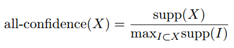

#  Extending arules with a new interest measure
renlanchuke  
2016年3月31日  

来源:[Introduction to arules – A computational environment for mining
association rules and frequent item sets][1]


```r
#加载arules包
library(arules)
data("Adult")
```
Eclat算法在等价类上求交集，将概念格划分为子概念格，然后自顶向上搜索，求频繁相集

```r
fsets <- eclat(Adult, parameter = list(support = 0.05),control = list(verbose=FALSE))
```
找到每个相集的支持度

```r
singleItems <- fsets[size(items(fsets)) == 1]
## Get the col numbers we have support for
singleSupport <- quality(singleItems)$support
names(singleSupport) <- unlist(LIST(items(singleItems),
decode = FALSE))
head(singleSupport, n = 5)
```

```
##        66        63       111        60         8 
## 0.9532779 0.9173867 0.8974243 0.8550428 0.6941976
```
全置信度
 

计算出全置信度

```r
itemsetList <- LIST(items(fsets), decode = FALSE)
allConfidence <- quality(fsets)$support /
sapply(itemsetList, function(x)
max(singleSupport[as.character(x)]))
quality(fsets) <- cbind(quality(fsets), allConfidence)
```


```r
summary(fsets)
```

```
## set of 8496 itemsets
## 
## most frequent items:
##            capital-loss=None native-country=United-States 
##                         4082                         3973 
##            capital-gain=None                   race=White 
##                         3962                         3781 
##            workclass=Private                      (Other) 
##                         3142                        21931 
## 
## element (itemset/transaction) length distribution:sizes
##    1    2    3    4    5    6    7    8    9   10 
##   36  303 1078 2103 2388 1689  706  171   21    1 
## 
##    Min. 1st Qu.  Median    Mean 3rd Qu.    Max. 
##   1.000   4.000   5.000   4.811   6.000  10.000 
## 
## summary of quality measures:
##     support        allConfidence    
##  Min.   :0.05002   Min.   :0.05247  
##  1st Qu.:0.06038   1st Qu.:0.06597  
##  Median :0.07546   Median :0.08428  
##  Mean   :0.10124   Mean   :0.11667  
##  3rd Qu.:0.11279   3rd Qu.:0.12711  
##  Max.   :0.95328   Max.   :1.00000  
## 
## includes transaction ID lists: FALSE 
## 
## mining info:
##   data ntransactions support
##  Adult         48842    0.05
```
找到所有关于Education的相集，然后按全置信度排序

```r
fsetsEducation <- subset(fsets, subset = items %pin% "education")
inspect(sort(fsetsEducation[size(fsetsEducation)>1],by = "allConfidence")[1 : 3])
```

```
##      items                                        support   allConfidence
## 6005 {education=HS-grad,hours-per-week=Full-time} 0.2090209 0.3572453    
## 6006 {education=HS-grad,income=small}             0.1807051 0.3570388    
## 6003 {workclass=Private,education=HS-grad}        0.2391794 0.3445408
```


[1]:https://cran.r-project.org/web/packages/arules/vignettes/arules.pdf
