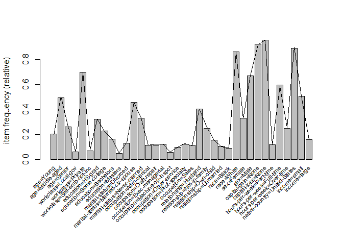
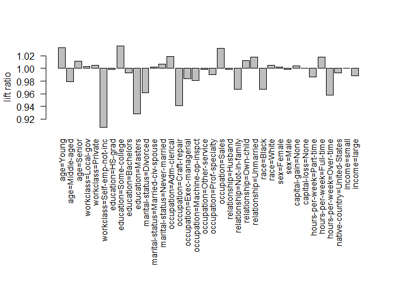

# Sampling
renlanchuke  
2016年4月2日  

来源:[Introduction to arules – A computational environment for mining
association rules and frequent item sets][1]


```r
#加载arules包
library(arules)
data("Adult")
Adult
```

```
## transactions in sparse format with
##  48842 transactions (rows) and
##  115 items (columns)
```

最小支持度为supp=0.05，误差epsilon=0.1，置信度1-c=0.9

计算合理的取样大小

```r
supp <- 0.05
epsilon <- 0.1
c <- 0.1
n <- -2 * log(c)/ (supp * epsilon^2)
n
```

```
## [1] 9210.34
```


```r
AdultSample <- sample(Adult, n, replace = TRUE)
```

USER时间就是执行表达式消耗的时间(CPU时间)

```r
#计算完整数据消耗时间
time <- system.time(itemsets <- eclat(Adult,
parameter = list(support = supp), control = list(verbose = FALSE)))
time
```

```
##    user  system elapsed 
##    0.41    0.00    0.41
```


```r
#计算样本数据消耗时间
timeSample <- system.time(itemsetsSample <- eclat(AdultSample,
parameter = list(support = supp), control = list(verbose = FALSE)))
timeSample
```

```
##    user  system elapsed 
##    0.10    0.00    0.14
```

加速比

```r
time[1] / timeSample[1]
```

```
## user.self 
##       4.1
```


比较样本中相集和数据相集支持度的差异

样品相集支持度为柱形，原始数据库相集为线型

```r
itemFrequencyPlot(AdultSample, population = Adult, support = supp,
cex.names = 0.7)
```

 

提升率lift： P(i | sample)/P(i | population)
用提升率比较样本数据和原始数据库的差异

```r
itemFrequencyPlot(AdultSample, population = Adult,support = supp, lift = TRUE,cex.names = 0.9)
```

 


```r
itemsets
```

```
## set of 8496 itemsets
```

```r
itemsetsSample
```

```
## set of 8443 itemsets
```


```r
match <- match(itemsets, itemsetsSample, nomatch = 0)
sum(match > 0) / length(itemsets)
```

```
## [1] 0.9676318
```


```r
summary(quality(itemsets[match == 0])$support)
```

```
##    Min. 1st Qu.  Median    Mean 3rd Qu.    Max. 
## 0.05002 0.05057 0.05123 0.05148 0.05215 0.05553
```

```r
summary(quality(itemsetsSample[-match])$support)
```

```
##    Min. 1st Qu.  Median    Mean 3rd Qu.    Max. 
## 0.05005 0.05049 0.05092 0.05129 0.05179 0.05603
```


```r
supportItemsets <- quality(itemsets[which(match > 0)])$support
supportSample <- quality(itemsetsSample[match])$support
accuracy <- 1 - abs(supportSample - supportItemsets) / supportItemsets
summary(accuracy)
```

```
##    Min. 1st Qu.  Median    Mean 3rd Qu.    Max. 
##  0.8519  0.9562  0.9754  0.9702  0.9895  1.0000
```

[1]:https://cran.r-project.org/web/packages/arules/vignettes/arules.pdf
