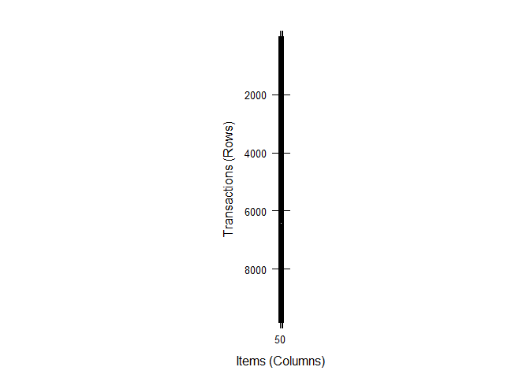

# Summary and Outlook
renlanchuke  
2016年4月2日  

加载arules程序包

```r
library(arules)  
```

```
## Loading required package: Matrix
## 
## Attaching package: 'arules'
## 
## The following objects are masked from 'package:base':
## 
##     abbreviate, write
```
加载数据集

```r
data(Groceries) 
```


```r
image(Groceries) 
```

 

求频繁项集

```r
frequentsets=eclat(Groceries,parameter=list(support=0.05,maxlen=10)) 
```

```
## Eclat
## 
## parameter specification:
##  tidLists support minlen maxlen            target   ext
##     FALSE    0.05      1     10 frequent itemsets FALSE
## 
## algorithmic control:
##  sparse sort verbose
##       7   -2    TRUE
## 
## Absolute minimum support count: 491 
## 
## create itemset ... 
## set transactions ...[169 item(s), 9835 transaction(s)] done [0.01s].
## sorting and recoding items ... [28 item(s)] done [0.00s].
## creating sparse bit matrix ... [28 row(s), 9835 column(s)] done [0.00s].
## writing  ... [31 set(s)] done [0.00s].
## Creating S4 object  ... done [0.00s].
```
察看求得的频繁项集

```r
inspect(frequentsets[1:10])
```

```
##    items                         support   
## 1  {whole milk,yogurt}           0.05602440
## 2  {whole milk,rolls/buns}       0.05663447
## 3  {other vegetables,whole milk} 0.07483477
## 4  {whole milk}                  0.25551601
## 5  {other vegetables}            0.19349263
## 6  {rolls/buns}                  0.18393493
## 7  {yogurt}                      0.13950178
## 8  {soda}                        0.17437722
## 9  {root vegetables}             0.10899847
## 10 {tropical fruit}              0.10493137
```
根据支持度对求得的频繁项集排序并察看（等价于inspect(sort(frequentsets)[1:10]）

```r
inspect(sort(frequentsets,by="support")[1:10])  
```

```
##    items              support   
## 4  {whole milk}       0.25551601
## 5  {other vegetables} 0.19349263
## 6  {rolls/buns}       0.18393493
## 8  {soda}             0.17437722
## 7  {yogurt}           0.13950178
## 11 {bottled water}    0.11052364
## 9  {root vegetables}  0.10899847
## 10 {tropical fruit}   0.10493137
## 13 {shopping bags}    0.09852567
## 12 {sausage}          0.09395018
```
求关联规则

```r
rules=apriori(Groceries,parameter=list(support=0.01,confidence=0.01))
```

```
## Apriori
## 
## Parameter specification:
##  confidence minval smax arem  aval originalSupport support minlen maxlen
##        0.01    0.1    1 none FALSE            TRUE    0.01      1     10
##  target   ext
##   rules FALSE
## 
## Algorithmic control:
##  filter tree heap memopt load sort verbose
##     0.1 TRUE TRUE  FALSE TRUE    2    TRUE
## 
## Absolute minimum support count: 98 
## 
## set item appearances ...[0 item(s)] done [0.00s].
## set transactions ...[169 item(s), 9835 transaction(s)] done [0.00s].
## sorting and recoding items ... [88 item(s)] done [0.00s].
## creating transaction tree ... done [0.01s].
## checking subsets of size 1 2 3 4 done [0.00s].
## writing ... [610 rule(s)] done [0.00s].
## creating S4 object  ... done [0.00s].
```
查看关联规则概要

```r
summary(rules)    
```

```
## set of 610 rules
## 
## rule length distribution (lhs + rhs):sizes
##   1   2   3 
##  88 426  96 
## 
##    Min. 1st Qu.  Median    Mean 3rd Qu.    Max. 
##   1.000   2.000   2.000   2.013   2.000   3.000 
## 
## summary of quality measures:
##     support          confidence           lift       
##  Min.   :0.01007   Min.   :0.01027   Min.   :0.7899  
##  1st Qu.:0.01159   1st Qu.:0.08892   1st Qu.:1.1494  
##  Median :0.01464   Median :0.15901   Median :1.4905  
##  Mean   :0.02138   Mean   :0.19096   Mean   :1.5578  
##  3rd Qu.:0.02227   3rd Qu.:0.26185   3rd Qu.:1.8338  
##  Max.   :0.25552   Max.   :0.58621   Max.   :3.3723  
## 
## mining info:
##       data ntransactions support confidence
##  Groceries          9835    0.01       0.01
```
求所需要的关联规则子集

```r
x=subset(rules,subset=rhs%in%"whole milk"&lift>=1.2) 
```
根据支持度对求得的关联规则子集排序并察看

```r
inspect(sort(x,by="support")[1:5]) 
```

```
##     lhs                   rhs          support    confidence lift    
## 513 {other vegetables} => {whole milk} 0.07483477 0.3867578  1.513634
## 511 {rolls/buns}       => {whole milk} 0.05663447 0.3079049  1.205032
## 507 {yogurt}           => {whole milk} 0.05602440 0.4016035  1.571735
## 493 {root vegetables}  => {whole milk} 0.04890696 0.4486940  1.756031
## 483 {tropical fruit}   => {whole milk} 0.04229792 0.4031008  1.577595
```
