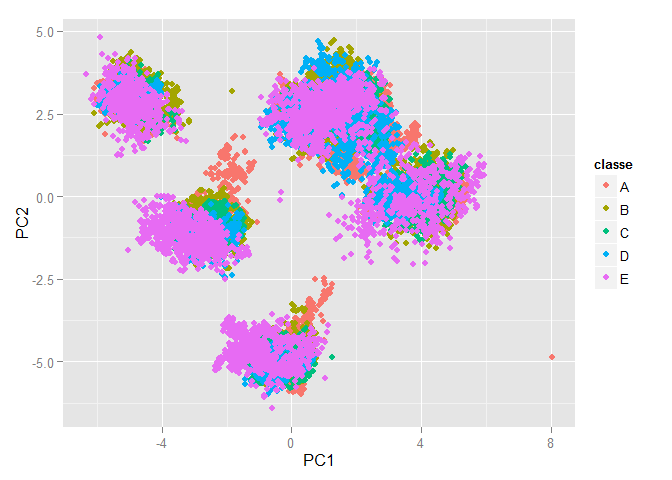

# PraMachineLearning
renlanchuke  
2015年12月23日  

##Personal activity analysis
####Load data
<font size=4>Load data from accelerometers on the belt, forearm, arm, and dumbell of 6 participants.
The data for this project come from this source: http://groupware.les.inf.puc-rio.br/har</font>

```r
#set the workpath
rm(list=ls())
setwd("F://gitRespository//PraMachineLearning")
#download the training and testing data
#trainingUrl<-"https://d396qusza40orc.cloudfront.net/predmachlearn/pml-training.csv"
#testingUrl<-"https://d396qusza40orc.cloudfront.net/predmachlearn/pml-testing.csv"
#download.file(trainingUrl,destfile = "./trainingData.csv",method = "wininet")
#download.file(testingUrl,destfile = "./testingData.csv",method = "wininet")
#read the data file
trainingData<-read.csv("./trainingData.csv")
testingData<-read.csv("./testingData.csv")
set.seed(2333)
```

####Exploratory data analysis


```r
summary(trainingData)
head(trainingData)

sum(complete.cases(trainingData))
```

####Data proprocess

```r
#load package
library(caret)
```

```
## Warning: package 'caret' was built under R version 3.2.3
```

```
## Loading required package: lattice
## Loading required package: ggplot2
```

```r
library(kernlab)
library(RANN)
```

```
## Warning: package 'RANN' was built under R version 3.2.3
```

```r
library(randomForest)
```

```
## Warning: package 'randomForest' was built under R version 3.2.3
```

```
## randomForest 4.6-12
## Type rfNews() to see new features/changes/bug fixes.
```

```r
library(ggplot2)
```
####Data preprocess

```r
#remove the factor variable
variableName <- names(trainingData)
preVariables <- variableName[3:159]
facVariable <- sapply(preVariables,function(x){
    is.factor(trainingData[,x])
})

goodVarNames <- preVariables[!facVariable]

#remove the all na variable in testingData
predVariables <- sapply(goodVarNames, function(x){
    sum(is.na(testingData[,x]))<5
})

predicts <-goodVarNames[predVariables]

trainingSet <- trainingData[,c(predicts,variableName[160])]

testingSet <-testingData[,c(predicts,"problem_id")]

#Data normalization

preObjNormlization <-preProcess(trainingSet[,predicts],method=c("center","scale"))
trainingSet <- predict(preObjNormlization,trainingSet)
testingSet <- predict(preObjNormlization,testingSet)
#fill the missing value
preObjknn<-preProcess(trainingSet[,predicts],method="knnImpute")
trainingSet[,predicts] <- predict(preObjknn,trainingSet[,predicts])
#testingSet[,goodVarNames] <- predict(preObjknn,testingSet[,goodVarNames])
#predict(preObj1,trainingData1[,variableName])
#meanVal<-colMeans(trainingData1[,variableName],na.rm = TRUE)
#names(meanVal)
```

###PCA analysis

```r
#pca analysis
preObjPCA<-preProcess(trainingSet[,predicts],method="pca",pcaComp = 2)
trainingPCA <- predict(preObjPCA,trainingSet)
#plot the pca parameter respect by classe

qplot(PC1,PC2,data=trainingPCA,col=classe)
```

 

####Create the training data and testing data

```r
#create the train set and validate set 
inTrain <- createDataPartition(y=trainingSet$classe,p=0.7,list = FALSE)

training <- trainingSet[inTrain,]
testing <- trainingSet[-inTrain,]

#tinyTrain <- createDataPartition(y=training$classe,p=0.1,list = FALSE)
#tinyTraining <- training[tinyTrain,]
```

####Machine learning:using random forest

```r
rfFit <- train(classe~.,data = training,methods="rf",
               trControl=trainControl(method = "cv",number = 3,verboseIter = TRUE))
```

```
## + Fold1: mtry= 2 
## - Fold1: mtry= 2 
## + Fold1: mtry=28 
## - Fold1: mtry=28 
## + Fold1: mtry=55 
## - Fold1: mtry=55 
## + Fold2: mtry= 2 
## - Fold2: mtry= 2 
## + Fold2: mtry=28 
## - Fold2: mtry=28 
## + Fold2: mtry=55 
## - Fold2: mtry=55 
## + Fold3: mtry= 2 
## - Fold3: mtry= 2 
## + Fold3: mtry=28 
## - Fold3: mtry=28 
## + Fold3: mtry=55 
## - Fold3: mtry=55 
## Aggregating results
## Selecting tuning parameters
## Fitting mtry = 28 on full training set
```

```r
rfPred <- predict(rfFit,newdata=testing)
confusionMatrix(testing$classe,rfPred)
```

```
## Confusion Matrix and Statistics
## 
##           Reference
## Prediction    A    B    C    D    E
##          A 1674    0    0    0    0
##          B    0 1138    1    0    0
##          C    0    3 1023    0    0
##          D    0    0    3  960    1
##          E    0    0    0    0 1082
## 
## Overall Statistics
##                                           
##                Accuracy : 0.9986          
##                  95% CI : (0.9973, 0.9994)
##     No Information Rate : 0.2845          
##     P-Value [Acc > NIR] : < 2.2e-16       
##                                           
##                   Kappa : 0.9983          
##  Mcnemar's Test P-Value : NA              
## 
## Statistics by Class:
## 
##                      Class: A Class: B Class: C Class: D Class: E
## Sensitivity            1.0000   0.9974   0.9961   1.0000   0.9991
## Specificity            1.0000   0.9998   0.9994   0.9992   1.0000
## Pos Pred Value         1.0000   0.9991   0.9971   0.9959   1.0000
## Neg Pred Value         1.0000   0.9994   0.9992   1.0000   0.9998
## Prevalence             0.2845   0.1939   0.1745   0.1631   0.1840
## Detection Rate         0.2845   0.1934   0.1738   0.1631   0.1839
## Detection Prevalence   0.2845   0.1935   0.1743   0.1638   0.1839
## Balanced Accuracy      1.0000   0.9986   0.9977   0.9996   0.9995
```

####Predict the value

```r
predict(rfFit,newdata=testingSet)
```

```
##  [1] B A B A A E D B A A B C B A E E A B B B
## Levels: A B C D E
```


